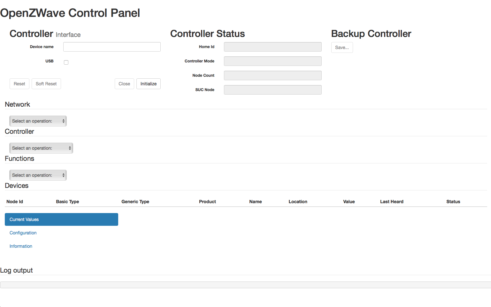

# ruimarinho/openzwave

An OpenZWave docker image with the OpenZWave Control Panel built-in.

[![build status][travis-image]][travis-url]
[![ruimarinho/openzwave][docker-pulls-image]][docker-hub-url] [![ruimarinho/openzwave][docker-stars-image]][docker-hub-url] [![ruimarinho/openzwave][docker-size-image]][docker-hub-url] [![ruimarinho/openzwave][docker-layers-image]][docker-hub-url]

## Supported tags and respective `Dockerfile` links

- `1.4.2784`, `1.4`, `latest` ([Dockerfile](https://github.com/ruimarinho/docker-openzwave/blob/master/Dockerfile))

This image will be automatically updated whenever there is an update to the base image (`alpine`).

## What is the OpenZWave Control Panel?

_from [openzwave/open-zwave-control-panel](https://github.com/OpenZWave/open-zwave-control-panel):_

The OpenZWave Control Panel (ozwcp for short) is an application built on the OpenZWave library that permits users to query, manage and monitor Z-Wave nodes and networks. It provides a web based user interface using AJAX principles.

## Introduction

The project is built by fetching the code directly from the git repository which allows it to retain the proper revision number.

Unlike the [official image](https://hub.docker.com/r/openzwave/openzwave-control-panel/), the supplementary config files are all available, providing the necessary device database (`device_classes.xml` and other manufacturer specific XML files) to include and manage your Z-Wave devices. Gone are the `Failed to Parse options.xml: Failed to open file` warning messages on the console.

### zwcfg_0x_\<HomeId\>.xml

By default OpenZWave will read and store the `zwcfg_0x_<HomeId>.xml` config file under `/root/open-zwave-control-panel/zwcfg_0x<HomeId>.xml`. You will need to press `Save` at the right top corner whenever you introduce modifications.

The `HomeId` (technically known as the `Network ID`) is responsible for the logical network isolation between Z-Wave nodes. Controllers come with a factory programmed Home ID which cannot be changed.

The `zwcfg_0x_<HomeId>.xml` can be shared with other applications (such as [Home Assistant](https://home-assistant.io)), but it should never be written by two simultaneous applications to avoid out-of-sync data from being read. Make you guarantee an exclusive lock on this file by stopping any application from modifying it

However, note the that `zwcfg_0x_<HomeId>.xml` is not a critical file. If you damage or lose it, the OpenZWave Control Panel will automatically recreate it with refreshed network information. Custom metadata, such as routes definitions, names and locations **will be lost**. If you have a lot of Z-Wave devices, it can be very cumbersome to re-do it all over.

### options.xml

The `options.xml` file [controls various OpenZWave settings](https://github.com/OpenZWave/open-zwave/wiki/Config-Options) including defining the Network Key (i.e. the Encryption Key) for Z-Wave+ networks/devices. If you're using Z-Wave+ and you lose this file, the controller will be unable to communicate with the devices.

Similarly to the `zwcfg_0x_<HomeId>.xml` files, ensure a single paplication is reading and/or modifying this file at a time.

## Usage

### How to use this image

To launch the OpenZWave Control Panel, you should add a device map to your Z-Wave Controller and map the server port (by default `8090`).

In this example, the USB Z-Wave Controller is available on the host under `/dev/ttyACM0`, but the USB device enumeration varies from host and OS (another popular nomenclature is `/dev/ttyUSB*`).

```sh
❯ docker run --rm -it -p 8090:8090 --device=/dev/ttyACM0 ruimarinho/openzwave
```

Now go to http://127.0.0.1:8090 and enter `/dev/ttyACM0` under `Device name`. Click on `Initialize` to boot the network and that's it.



Since the OpenZWave Control Panel is usually ran for debugging purposes, the images runs as root so that there are no complicated settings or permissions to deal with. It should just work for quick Z-Wave network diagnostics and operations.

### Integration with Home Assistant

As mentioned below, you can also share the `zwcfg_0x_<HomeId>.xml` and `options.xml` file between applications on the host.
The following is an example of sharing the Z-Wave network configuration with the popular [Home Assistant](https://home-assistant.io) home automation software, available under `/volume1/applications/home-assistant/`.

First, stop Home Assistant. Assuming you've used `--name home-assistant` when launching the container (otherwise you need to grab its container id), run:

```sh
❯ docker stop home-assistant
```

Launch the OpenZWave Control Panel:

```sh
❯ docker run --name openzwave --rm -it -p 8090:8090 \
  --device=/dev/ttyACM0 \
  -v /volume1/applications/home-assistant/options.xml:/root/open-zwave-control-panel/config/options.xml \
  -v /volume1/applications/home-assistant/zwcfg_0x00001111.xml:/root/open-zwave-control-panel/zwcfg_0x00001111.xml \
  ruimarinho/openzwave
```

Run all the desired operations on the OpenZWave Control Panel and don't forget to hit `Save` if you've changed something.

When you're done, stop the OpenZWave Control Panel and launch Home Assistant again:

```sh
❯ docker stop openzwave && docker start home-assistant
```

Done!

## Supported Docker versions

This image is officially supported on Docker version 1.12, with support for older versions provided on a best-effort basis.

## License

[License information](https://github.com/OpenZWave/open-zwave-control-panel/blob/master/LICENSE) for the software contained in this image.

[License information](https://github.com/ruimarinho/docker-openzwave/blob/master/LICENSE) for the [ruimarinho/docker-openzwave][docker-hub-url] docker project.

[docker-hub-url]: https://hub.docker.com/r/ruimarinho/openzwave
[docker-layers-image]: https://img.shields.io/imagelayers/layers/ruimarinho/openzwave/latest.svg?style=flat-square
[docker-pulls-image]: https://img.shields.io/docker/pulls/ruimarinho/openzwave.svg?style=flat-square
[docker-size-image]: https://img.shields.io/imagelayers/image-size/ruimarinho/openzwave/latest.svg?style=flat-square
[docker-stars-image]: https://img.shields.io/docker/stars/ruimarinho/openzwave.svg?style=flat-square
[travis-image]: https://img.shields.io/travis/ruimarinho/docker-openzwave.svg?style=flat-square
[travis-url]: https://travis-ci.org/ruimarinho/docker-openzwave
